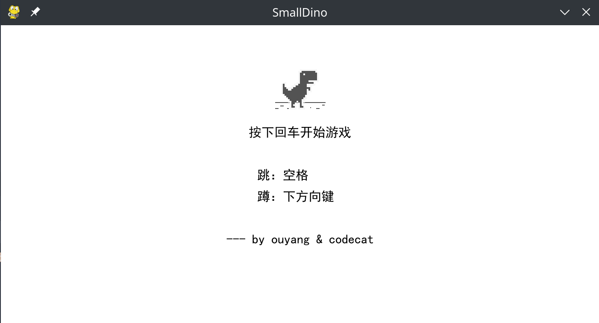

## 小恐龙快跑
### 1. 项目介绍
利用Pygame库编写谷歌浏览器中小恐龙快跑小游戏
### 2. 代码结构
```angular2html
|--dist：打包后可直接运行的程序
|--Fonts：字体文件
|--Ico：图标文件
|--Image：图像文件
|--Music：背景音乐
|--dino.py：包含背景，恐龙，障碍物，背景等的绘制，以及背景音乐的播放
|--setting.py：相关配置信息
|--main.py：主程序
```
### 3. 环境配置
```angular2html
pygame==2.1.0
```

### 4. 如何使用
直接运行`python main.py`即可

### 5. 效果展示

